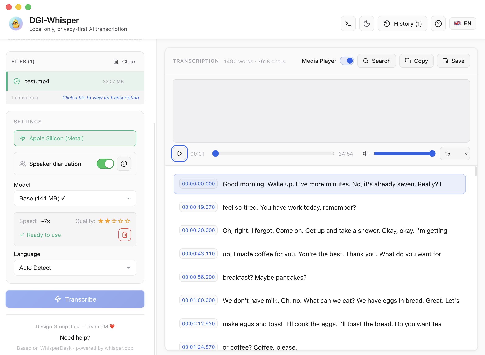

# 🎙️ DGI-Whisper

Local only, privacy-first AI transcription.

> Based on [WhisperDesk](https://github.com/PVAS-Development/whisperdesk) · powered by [whisper.cpp](https://github.com/ggml-org/whisper.cpp).



## ✨ Features

### Added by DGI-Whisper

- **Bundled FFmpeg** - FFmpeg ships inside the app, so the first launch works out of the box. If a newer system FFmpeg is installed (e.g. via Homebrew) it is preferred automatically.
- **Speaker Diarization (optional)** - Toggle on to automatically identify _who spoke when_. Each transcript segment gets a speaker label, and you can **rename**, **merge** or **split** speakers directly from the UI. Edits persist into the history. Runs fully on-device via [sherpa-onnx](https://github.com/k2-fsa/sherpa-onnx) with [pyannote segmentation 3.0](https://huggingface.co/pyannote/segmentation-3.0) + [3D-Speaker ERes2Net](https://github.com/modelscope/3D-Speaker) embeddings, ONNX models bundled in the DMG (no extra download).
- **Multilingual UI** - Switch between **Italian** and **English** via the flag toggle in the header. The choice persists across sessions. Default is detected from the system locale.

### Inherited from WhisperDesk

- **Drag & Drop** - Drag single or multiple files to create a batch queue
- **Batch Processing** - Process unlimited files sequentially with automatic queue management
- **Queue Persistence + Resume** - Restore unfinished queue items after restarting the app
- **Duplicate File Protection** - Automatically skips duplicates by file path/fingerprint in batch mode
- **Retry Failed Items** - One-click retry for failed or cancelled queue items
- **Live Batch ETA** - See estimated remaining time while batch processing is running
- **Completion Notifications** - Native notification when a batch finishes
- **Multiple Formats** - Supports MP3, WAV, M4A, FLAC, OGG, OPUS, OGA, AMR, WMA, AAC, AIFF, MP4, MOV, AVI, MKV, WebM, WMV, FLV, M4V
- **Embedded Media Preview** - Play the selected audio or video beside your transcript
- **Transcript Navigation** - Click timestamped transcript segments to seek directly to that moment in the media
- **Secure Local Streaming** - Media previews use a private `whisperdesk-media://` protocol with approved local files only
- **Cleaner Subtitles** - Improved VTT/SRT segmentation with better word-boundary splitting for readable captions
- **Multiple Models** - Choose from tiny, base, small, medium, large-v3, or large-v3-turbo Whisper models (including English-only variants)
- **Output Formats** - Export as VTT subtitles, SRT subtitles, plain text, Word (`.docx`), PDF, or Markdown (TXT and MD include the speaker labels when diarization is on)
- **Finder Reveal After Save** - Prompt to reveal the saved transcript directly in Finder
- **Audio Language Support** - Auto-detect or select from 12+ languages for transcription
- **Apple Silicon Optimized** - Native Metal GPU acceleration on M1/M2/M3/M4 Macs
- **Dark Mode** - Beautiful dark theme that respects your system preference
- **Keyboard Shortcuts** - Full keyboard navigation support
- **Transcription History + Search** - Keep track of recent transcriptions and search by file name, content, model, or language. Speaker label edits and merge/split changes are saved per history item.
- **Native Performance** - Uses whisper.cpp for fast, efficient transcription
- **TypeScript** - Fully typed codebase for better maintainability
- **Feature-Driven Architecture** - Modular codebase organized by feature domains

## 📋 Requirements

- **macOS** 10.15 (Catalina) or later. The DMG is a universal binary (arm64 + x64), so it runs natively on both Apple Silicon and Intel Macs.
- ~600MB disk space (for whisper.cpp, the bundled FFmpeg, and the base Whisper model; +45MB if diarization is enabled)

> **Note:** FFmpeg is bundled with the app, no separate install is needed. If a system FFmpeg is present (e.g. installed via Homebrew) it is preferred so you can pick up your own newer version.

## 🚀 Setup

1. Download the latest `DGIWhisper-x.x.x.dmg` from [Releases](https://github.com/giovannilombi/dgiwhisper/releases)
2. Open the DMG file
3. Drag **DGI-Whisper.app** onto the **Applications** shortcut inside the DMG
4. Open **Applications** and launch DGI-Whisper

> ⚠️ **First launch only — macOS will block the app.**
> Because the DMG is currently distributed **unsigned**, on macOS 15 (Sequoia) and newer the right-click → Open trick no longer works. You must explicitly authorise the app once via System Settings:
>
> 1. Try to open DGI-Whisper from Applications — macOS shows _"DGI-Whisper cannot be opened because Apple cannot check it for malicious software."_ Click **Done**.
> 2. Open the Apple menu () → **System Settings** → **Privacy & Security**.
> 3. Scroll to the bottom of the panel. You will see _"DGI-Whisper was blocked because it is not from an identified developer."_ Click **Open Anyway** next to it.
> 4. Authenticate with Touch ID or password, then click **Open Anyway** again in the confirmation dialog.
>
> From the second launch onwards the app starts normally — these steps are one-time.
>
> A copy of these instructions ships as **README.pdf** at the top of the DMG window itself, so end users have them at hand without leaving the installer.

If the app still refuses to open with a "damaged" message (rare, but possible after some downloads), strip the quarantine attribute and retry:

```bash
xattr -cr /Applications/DGI-Whisper.app
```

## 🎮 Usage

### 1. Add files

- Drag and drop audio or video files (single or batch) into the drop zone, or click it to browse.
- Multiple files queue up and are processed sequentially.
- Duplicates (same path / same fingerprint) are auto-skipped.

### 2. Configure the transcription

- **Speaker diarization** — toggle the red/green switch at the top of the Settings panel to enable speaker identification. Click the ⓘ next to it for an in-app explanation of the limits.
- **Whisper model** — pick the size/quality/speed trade-off (see _Whisper Models_ below). The selected model is downloaded automatically on first use.
- **Audio language** — `Auto` to let Whisper detect it, or pick from the supported language list.
- **UI language** — switch the interface between Italian and English with the flag toggle in the top-right header, independently from the audio transcription language.

### 3. Transcribe

Click **Transcribe** (or `⌘ Return`) to process the queue. Progress is shown per item, with a live ETA for batches. Click **Cancel** (or `Esc`) at any point — the running item is interrupted and any in-flight diarization worker is terminated immediately.

### 4. Review the transcript

When **diarization is off** the transcript appears as a single block. You can:

- Click any **timestamp** to jump the inline media player to that moment.
- Use `⌘ F` to open the inline search bar and step through matches.
- Toggle the media player on/off from the toolbar.

When **diarization is on** the transcript is grouped by speaker block. For each block you can:

- **Rename the speaker** — click the speaker label (e.g. _Speaker 1_) and type the real name (e.g. _Anna_). The change applies to every block of that cluster across the transcript.
- **Merge speakers** — when the algorithm split one person across multiple clusters, click **Merge** on a block and pick the target speaker from the dropdown. All blocks of the source cluster collapse into the target.
- **Split a block** — when the algorithm grouped two people into the same cluster, click **Split** on the wrongly-attributed block to assign it a fresh new speaker that you can then rename.

All edits (names, merges, splits) are saved into the transcription history alongside the original diarization, so re-opening a past transcription brings your refined labels back.

### 5. Export

Save from the toolbar (or `⌘ S`) and pick a format:

- **`.txt`** and **`.md`** — when diarization is on, these formats prepend the speaker label to each block (`Speaker 1: …` for txt, `**Speaker 1:** …` for markdown), using your renamed labels.
- **`.vtt`** and **`.srt`** — standard subtitle formats with timestamps. Speaker labels are not included in subtitles.
- **`.docx`** and **`.pdf`** — formatted document export.

Alternatively, use **Copy** (or `⌘ C`) to copy the plain transcription text to the clipboard.

### 6. History

The **History** button in the header (`⌘ H` to toggle) opens the list of every past transcription. Each entry stores the file name, model, language, duration, full text, and — when diarization was on — the speaker segments and your label/merge/split edits. Click any entry to reload it into the main view exactly as you left it.

### Keyboard Shortcuts

| Shortcut     | Action               |
| ------------ | -------------------- |
| `Cmd+O`      | Open file            |
| `Cmd+S`      | Save transcription   |
| `Cmd+C`      | Copy transcription   |
| `Cmd+Return` | Start transcription  |
| `Cmd+H`      | Toggle history       |
| `Escape`     | Cancel transcription |

## 🧠 Whisper Models

| Model            | Size   | Speed | Quality | Best For               |
| ---------------- | ------ | ----- | ------- | ---------------------- |
| `tiny`           | 75 MB  | ~10x  | ★☆☆☆☆   | Quick drafts, testing  |
| `base`           | 142 MB | ~7x   | ★★☆☆☆   | Fast transcription     |
| `small`          | 466 MB | ~4x   | ★★★☆☆   | Balanced speed/quality |
| `medium`         | 1.5 GB | ~2x   | ★★★★☆   | High quality           |
| `large-v3`       | 3.1 GB | ~1x   | ★★★★★   | Best quality           |
| `large-v3-turbo` | 1.6 GB | ~2x   | ★★★★★   | Fast + quality         |

English-only variants (`.en`) are available for tiny, base, small, and medium models.

Models are downloaded automatically on first use and cached in:

- **Development**: `PROJECT_ROOT/models/`
- **Production**: `~/Library/Application Support/DGI-Whisper/models/`

## 🔧 Development

### Architecture

This project follows a modern Electron architecture with strict separation of concerns:

- **`src/main/`**: Electron Main process (TypeScript). Handles OS integration, window management, and native services.
- **`src/preload/`**: Preload scripts (TypeScript). Exposes a secure, typed API to the renderer via `contextBridge`.
- **`src/renderer/`**: React application (TypeScript). The UI layer, built with Vite.
- **`src/shared/`**: Shared types and constants used by both Main and Renderer processes.

**Security Features:**

- **Context Isolation**: Enabled. Renderer cannot access Node.js primitives directly.
- **Sandbox**: Enabled. Renderer runs in a sandboxed environment.
- **IPC**: All communication happens via typed IPC channels defined in `src/main/ipc/`.
- **Media Preview Authorization**: Local previews are limited to user-approved media paths and served through time-bound `whisperdesk-media://` URLs.

## 🐛 Troubleshooting

### "whisper.cpp not found" error (developers only)

When building from source, run the setup script:

```bash
npm run setup:whisper
```

End users never see this error — the binary ships in the DMG.

### Speaker diarization detects the wrong number of speakers

Diarization is **unsupervised** — it guesses the number of speakers from voice similarity. Overlapping speech, similar voices, short interjections, or background noise can throw the count off. After transcription you can:

- Click a speaker name to **rename** the whole cluster
- Use **Merge** to collapse two clusters that are the same person
- Use **Split** to mark a single block as a different speaker

All edits persist into the transcription history.

### Switching UI language

Click the **🇮🇹 IT / 🇬🇧 EN** flag in the header (next to "History"). The choice persists across launches and is independent from the audio transcription language.

### Slow transcription

- Use a smaller model (tiny or base) for faster results
- Ensure you're using GPU acceleration (shown in app settings)
- Close other resource-intensive applications
- If you also enabled diarization, the extra pass adds roughly 15-30% to the total time on Apple Silicon

### App won't open (macOS Gatekeeper)

DGI-Whisper is currently distributed **unsigned**, so the first time you open it macOS Gatekeeper will block it. To allow it:

1. Right-click the app in Applications and select "Open"
2. Click "Open" in the dialog that appears

If that doesn't work (e.g. "app is damaged" message), remove the quarantine attribute and reopen:

```bash
xattr -cr /Applications/DGI-Whisper.app
```

## 🔒 Privacy & Security

- **Local Processing**: All audio/video processing happens **locally** on your device. Your files never leave your computer.
- **No Cloud Uploads**: We do not upload your media files or transcriptions to any server.
- **Private Media Preview**: Transcript playback uses local, approved media files only. Preview URLs are temporary and are not raw filesystem paths.
- **Anonymous Analytics**: We collect minimal, anonymous usage data (e.g., app launches, feature usage) to improve the app. No personal data or file content is collected.
- **Code Signing**: Currently unsigned. macOS Gatekeeper will require a one-time manual approval to launch the app — see [Troubleshooting](#app-wont-open-macos-gatekeeper).

## ☕ Support the Project

DGI-Whisper is a fork of [WhisperDesk](https://github.com/PVAS-Development/whisperdesk). If you find it useful, please consider supporting the **original project** that made this fork possible:

- [**Donate via PayPal**](https://www.paypal.com/donate/?hosted_button_id=HTJXGMEGMWWD6)
- [**Buy me a coffee**](https://www.buymeacoffee.com/pedrovsiqueira)

## 📄 License

MIT License - see [LICENSE](LICENSE) for details.

## 🙏 Acknowledgments

### Upstream

- [WhisperDesk](https://github.com/PVAS-Development/whisperdesk) by Pedro Siqueira — the original project this fork is based on
- [whisper.cpp](https://github.com/ggml-org/whisper.cpp) — high-performance C++ port of OpenAI Whisper
- [OpenAI Whisper](https://github.com/openai/whisper) — the speech recognition model that powers the transcription

### Speaker diarization stack

- [sherpa-onnx](https://github.com/k2-fsa/sherpa-onnx) by k2-fsa — the speech toolkit that runs the diarization pipeline on-device
- [sherpa-onnx-node](https://www.npmjs.com/package/sherpa-onnx-node) — Node.js Native API bindings for sherpa-onnx
- [pyannote-audio](https://github.com/pyannote/pyannote-audio) — pyannote/segmentation-3.0 ONNX model used for voice activity detection and turn segmentation
- [3D-Speaker](https://github.com/modelscope/3D-Speaker) — ERes2Net speaker embedding model from ModelScope
- [ONNX Runtime](https://onnxruntime.ai/) — cross-platform inference engine that executes the ONNX models locally

### Audio pipeline

- [FFmpeg](https://ffmpeg.org/) — the audio/video processing engine, bundled inside the app
- [@ffmpeg-installer/ffmpeg](https://www.npmjs.com/package/@ffmpeg-installer/ffmpeg) — npm package that ships platform-specific FFmpeg binaries

### App framework

- [Electron](https://www.electronjs.org/) — cross-platform desktop apps
- [React](https://react.dev/) — UI framework
- [TypeScript](https://www.typescriptlang.org/) — type-safe JavaScript
- [Vite](https://vitejs.dev/) — build tool
- [Vitest](https://vitest.dev/) — fast unit testing framework
- [lucide-react](https://lucide.dev/) — icons

---

Made with ❤️ for the transcription community
